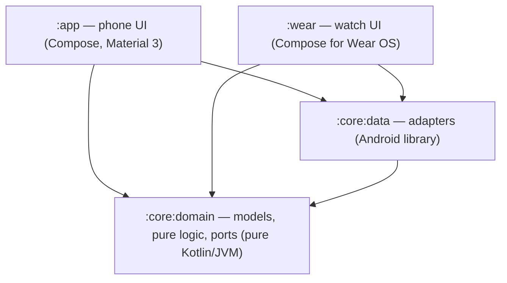

# Architecture

Clean architecture with ports and adapters. Dependencies point inward only:
`:app` / `:wear` → `:core:data` → `:core:domain`. The Konsist rules in `:architecture-test`
enforce the boundaries.

## Layers

### Domain (`:core:domain`, package `dev.sadakat.qit.core.domain`)
Pure Kotlin/JVM — no Android, no androidx, no imports from outer layers
(`DomainIsolationTest` fails the build otherwise).

- `model/` — `QuranMeta` (surah structure, global ayah numbering), `Surah`, `Ayah`, `AyahRef`,
  `Revelation`, `Track`, `RecitationMode`
- `audio/` — `QuranAudioUrls` (file URLs + download ids), `QueuePlan` + `QueueItemId` +
  `QueueEntry` (the play queue), `DownloadAggregation` + `FileDownloadState`
- `repository/` — the ports `QuranText`, `QuranSettings` (+ `LastPosition`), `SurahDownloads`
  (+ `SurahDownloadState` and `stateOf` helpers)
- `player/` — the port `QuranPlayer` (+ `NowPlaying`)

### Data (`:core:data`, package `dev.sadakat.qit.core.data`)
Android library; one adapter per port:

| Port | Adapter |
| --- | --- |
| `QuranText` | `text/AssetQuranText` (assets parsed by `text/QuranTextParser`) |
| `QuranSettings` | `settings/DataStoreQuranSettings` |
| `SurahDownloads` | `audio/MediaSurahDownloads` (Media3 downloads via `audio/QuranCache`) |
| `QuranPlayer` | `player/ExoQuranPlayer` (the app-wide `ExoPlayer`) |

Plus `audio/QuranDownloadService` (foreground download service), `audio/QuranMediaItems`
(queue → media items) and `link/` (`QuranDownloadMessage`, `WearPaths`).

### Presentation (`..presentation..` in `:app` and `:wear`)
- Talks to **domain ports only** — importing `dev.sadakat.qit.core.data` fails
  `PresentationIsolationTest`.
- `@HiltViewModel` ViewModels expose one immutable `StateFlow<XxxUiState>` (data class) plus
  plain functions for user actions (unidirectional data flow).
- Stateless screen composables take the UiState + lambdas; a thin `XxxRoute` composable wires in
  the ViewModel. Every composable that emits UI takes `modifier: Modifier = Modifier`.
- No `!!`, no `GlobalScope`, no blocking calls on the main thread, no `Context` in ViewModel
  constructors, no public `MutableStateFlow` (all checked by `ViewModelArchitectureTest` /
  `UiStateArchitectureTest`).

## Where business logic lives
Rules that are true regardless of platform — the queue for a surah in a mode, basmala prefix
rules, next/previous-by-ayah, download aggregation, URL layout — are pure objects in the domain
and unit-tested on the JVM. Android specifics (when to start a service, how to observe the
`DownloadManager`, DataStore keys) stay in the adapters.

## Conventions
- Kotlin official style, 4-space indent, 120 cols, no wildcard imports, trailing commas ok
  (Spotless + ktlint, config in `.editorconfig`).
- KDoc on public types; comments explain *why*.
- TDD is mandatory: red → green → refactor (see `docs/QUALITY.md` and the test stacks in
  `data-flow.md` / `build-config.md`).

## Detailed docs
`docs/ARCHITECTURE.md` covers the queue model, downloads, playback wiring and the phone→watch
message in depth.
