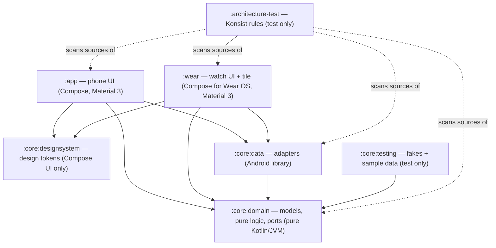

# Architecture

QIt is a Quran player for phone and Wear OS, built as clean architecture with ports and adapters.
The domain is a pure Kotlin island; everything Android (ExoPlayer, DataStore, assets, the Wearable
data layer) lives in adapters behind interfaces. Both apps (`:app`, `:wear`) are thin presentation
layers over the same core.

## Modules

Dependency rule: **inward only**. `:core:domain` imports nothing from Android or the outer layers
(enforced by `DomainIsolationTest`); presentation code (`..presentation..`) imports domain ports
only, never `dev.sadakat.qit.core.data` (enforced by `PresentationIsolationTest`). Both tests are
Konsist rules in `:architecture-test`. `:core:designsystem` depends on nothing of ours and on no
Material library (`DesignSystemArchitectureTest`), so both apps can share it.

## The domain (`:core:domain`)

**Fixed structure of the Quran** — `model/QuranMeta.kt` knows the 114 surah lengths and converts
between per-surah ayah numbers and the global ayah numbering (1..6236) every audio source uses. It
also answers `hasBasmalaPrefix` (true for every surah except Al-Fatiha and At-Tawbah) and knows
where each of the 30 juz starts (`juzStart`, `juzOf`).

**Models** (`model/`):

- `Surah` — number, Arabic/transliterated/English names, ayah count, `Revelation` (Meccan/Medinan).
- `Ayah` — one verse with Arabic (Uthmani), English (Saheeh International) and Bangla (Muhiuddin
  Khan) text; `translation(track)` picks the translation of a track.
- `AyahRef` — a position (`surah`, `ayah`); ayah 0 is the basmala before verse 1.
- `Track` — one recording: `ARABIC`/`ENGLISH`/`BANGLA` with stable codes `ar`/`en`/`bn` used in
  media ids, download ids and messages.
- `RecitationMode` — what plays for each ayah, in order: `ARABIC_ONLY`, `ARABIC_ENGLISH` or
  `ARABIC_BANGLA`.
- `ReadingPrefs` — the reading settings: `ArabicTextSize` (a scale factor), show translation,
  follow along, `ThemeMode`, wallpaper colors.
- `AyahRefParser` — reads a typed reference ("2:255", "2.255", "২:২৫৫", "٢:٢٥٥") into an `AyahRef`
  when that ayah exists; search uses it to jump.
- `ArabicWords` — an ayah's words as the word pointer moves over them: whitespace tokens, where a
  standalone pause mark (ۖ ۗ ۚ …, ۞, ۩) belongs to its neighbouring word. The bundled word timings
  count words the same way.
- `ListeningProgress` — from the heard counts: per surah (`SurahListening`) its full **rounds**
  (every ayah heard that many times), how far the next round has come, listens and time; for the
  Quran (`QuranListening`) the ayahs heard, rounds and time; and the Progress screen's orders.

**Pure logic** (`audio/`):

- `QuranAudioUrls` — where each verse file lives (see [Audio sources](#audio-and-downloads)) and
  the download id of each file (`"ar/255"`, `"bn/intro/2"`, …).
- `QueuePlan` — builds a surah's play queue and computes next/previous by ayah (see
  [The queue model](#the-queue-model)).
- `DownloadAggregation` — derives per-surah download state from per-file state (see
  [Downloads](#audio-and-downloads)), and a running batch's whole progress (`batchProgress`).
- `WordTimings` — when each word of an ayah is recited in its file; `wordAt(positionMs)`.
- `SurahTimeline` — a queue laid end to end from its files' lengths: an item position is a surah
  position (`positionOf`) and back (`locate`).

**Playback options** (`player/`): `PlaybackSpeed` (0.75×–1.5×), `RepeatSetting` (`Off`, `Ayah(times)`
— every ayah N times, or the current one forever — and `Range(from, to, times)`), `SleepOption`
(minutes or end of surah) and `SleepTimerStatus`. Their rules are pure:

- `RepeatPolicy` — what happens when an ayah ends (`Advance`, `JumpTo(ayah)`, `Finish` after a
  counted range's last round), how a manual move affects a repeat (an ayah repeat restarts its
  count; a range survives moves inside it and is dropped once playback leaves it), and where
  playback jumps when a range is chosen elsewhere. The basmala never repeats.
- `SleepTimer` — status, fade volume and "is due" from explicit timestamps: the last 20 s fade out
  on an equal-power curve, and the end-of-surah stop fades over the last seconds of recitation in
  wall time (media time divided by the speed).
- `ListenTracker` — which ayahs count as heard: an ayah counts once its **Arabic** item plays to its
  end; skipping it, starting it in the middle or jumping forward inside it doesn't count; each
  play-through counts (so each memorizing repeat does). The basmala never counts.
- `WordPointer` — where the pointer is: `Reciting(word)` while the Arabic plays, `Translating` while
  the translation does, `Off` otherwise; `WordPointer.of(nowPlaying, progress, timings)`.
- `PlaybackProgress` — the position in the current item and in the whole surah, and its length.

**Ports** — interfaces the adapters implement:

| Port | Package | What it gives |
| --- | --- | --- |
| `QuranText` | `repository/` | All surahs and every surah's ayahs (offline, from assets) |
| `QuranSettings` | `repository/` | `Flow<RecitationMode>`, `Flow<LastPosition?>`, `Flow<ReadingPrefs>` and `Flow<PlaybackSpeed>`, persisted |
| `SurahDownloads` | `repository/` | `StateFlow<Map<Int, Map<Track, SurahDownloadState>>>` (surah number → track → state), `download(surah, tracks)`, `remove(surah, tracks)` |
| `QuranPlayer` | `player/` | `StateFlow<NowPlaying?>` (with speed and repeat), `StateFlow<String?>` error, `StateFlow<SleepTimerStatus>`, `Flow<PlaybackProgress>` (ticks while playing) and `Flow<WordPointer>` (once per word); `play`, `togglePlayPause`, `nextAyah`, `previousAyah`, `seekTo(surahPositionMs)`, `stop`, `restoreLast`, `setRepeat`, `setSpeed`, `setSleepTimer` |
| `AudioTimings` | `repository/` | Each surah's `WordTimings` by ayah (ayah 0 = the basmala, recited from 1:1's file) and every audio file's length |
| `ListeningHistory` | `repository/` | `Flow<ListeningCounts>` (heard counts per ayah, last heard and time per surah, over all devices), `recordHeard`, `addListeningTime`, `localSnapshot`/`importSnapshot` (device sync) and `reset` |

## The adapters (`:core:data`)

| Port | Adapter | How |
| --- | --- | --- |
| `QuranText` | `text/AssetQuranText` | Reads `assets/quran/surahs.json` and `assets/quran/text/001..114.json` (generated by `scripts/build_quran_text.py`), parsed by `QuranTextParser`; keeps the 6 most recently used surahs in memory |
| `QuranSettings` | `settings/DataStoreQuranSettings` | Preferences DataStore `quran_settings` |
| `SurahDownloads` | `audio/MediaSurahDownloads` | Media3 `DownloadManager` from `QuranCache`, one download per verse file |
| `QuranPlayer` | `player/ExoQuranPlayer` | The app-wide `ExoPlayer` |
| `AudioTimings` | `audio/AssetAudioTimings` | Reads `assets/quran/timing/ar.alafasy/001..114.json` and `assets/quran/audio/durations.json` (generated by `scripts/build_audio_timing.py`), parsed by `AudioTimingParser`; keeps a few surahs' timings in memory |
| `ListeningHistory` | `listening/RoomListeningHistory` | Room `QuranDatabase` (`quran.db`, version 1, schema exported to `core/data/schemas/`): `ayah_listens` and `surah_listening` rows per **source** (`local`, or `watch:<node>` for what a watch sent), summed for the counts; a reset clears every source and remembers when, so a snapshot counted before it is ignored |

Supporting pieces: `audio/QuranCache` (the shared cache + download manager), `audio/QuranDownloadService`
(foreground service for downloads, with `DownloadNotifications` and `SurahFinishes`),
`audio/QuranMediaItems` (queue → media items), `player/ListeningRecorder` (writes what is heard),
`link/QuranDownloadMessage`, `link/ListeningMessages` + `link/WearPaths` (phone ↔ watch).

## The queue model

`QueuePlan.plan(surah, mode)` builds the queue as a flat list of `QueueEntry`s:

1. **Basmala prefix** (ayah 0), only for surahs with one (`QuranMeta.hasBasmalaPrefix`):
   - Arabic only → the Arabic basmala,
   - Arabic + English → Arabic basmala, then the English one,
   - Arabic + Bangla → only the Bangla intro (`bn/intro/{surah}`) — it already contains the Arabic
     basmala followed by its translation, so no separate Arabic prefix.
2. **Verses** — for each ayah 1..ayahCount, one entry per track of the mode, in the mode's order.

Each entry's identity is a `QueueItemId` (`surah`, `ayah`, `track`); its media id is
`"{surah}:{ayah}:{trackCode}"`, e.g. `2:255:ar`. `QueueItemId.parse` is the inverse, returning null
for anything that is not a Quran queue item.

Navigation is **by ayah, not by item**: because ayah numbers grow monotonically along the queue,
`nextAyahIndex` finds the first item beyond the current ayah's, and `previousAyahIndex` restarts the
current ayah when the player is past its first item or more than 3 s into it, else jumps to the
previous ayah's first item. The same rules apply to the media notification's next/previous buttons
(see below).

## Audio and downloads

Three verse-by-verse recordings, addressed by global ayah number (`QuranAudioUrls`):

| Track | Source |
| --- | --- |
| Arabic (Alafasy, 128k) | `https://cdn.islamic.network/quran/audio/128/ar.alafasy/{global}.mp3` |
| English (Walk, 192k) | `https://cdn.islamic.network/quran/audio/192/en.walk/{global}.mp3` |
| Bangla | `https://huggingface.co/datasets/faddy001/quran_audio/resolve/main/bangla/bangla-translation-verses/{NNNNN}.mp3` |

Arabic and English reuse verse 1 of the Quran (which *is* the basmala) as their basmala; Bangla uses
a per-surah intro file. `QuranAudioUrls.surahFiles(surah, track)` lists every file a surah/track
pair needs — basmala (if any) plus all verses.

**One Media3 download per verse file.** `MediaSurahDownloads.download(surah, tracks)` enqueues a
`DownloadRequest` per file into `QuranCache`'s `DownloadManager` (max 4 parallel downloads, requires
a network), skipping files already completed, and starts `QuranDownloadService` so downloads survive
the app going away. Downloaded files land in `QuranCache`'s `SimpleCache`
(`<filesDir>/quran_audio`, never evicted — files leave only through `remove`).

**Aggregation** (`DownloadAggregation`): the state of a surah/track pair is derived from the states
of its files, keyed by download id. Download ids are globally unique per verse file — except the
shared basmala `"ar/1"`/`"en/1"`, which every surah's file list contains (and which doubles as
Al-Fatiha's first verse). The aggregator therefore only counts *own* files — ids that belong to this
pair alone — when deciding whether a pair is tracked at all, so downloading Al-Baqarah never makes
Al-Fatiha look half-downloaded. A pair is `Downloaded` when all files are completed, `Downloading`
while any file is active, `Failed` when some failed for good (downloading again retries).
`remove` deletes a pair's files, but keeps a shared basmala alive while any other tracked pair still
needs it. The combined `stateOf(surah, tracks)` helpers roll several tracks (e.g. a mode's) into
one state for the UI.

**The notification.** Media3's own progress notification averages only the few files in flight, so
with one download per ayah its bar kept filling and restarting. `QuranDownloadService` builds its
own (`DownloadNotifications`) from `DownloadAggregation.batchProgress` over the queued and running
files: every surah/track pair with an own file in flight counts with all its files, so the bar is
the whole batch's ("Downloading Al-Kahf · 64%", "Downloading 3 surahs") and only ever rises. It says
when it waits for a network, and `SurahFinishes` posts one notification per surah that finishes —
ready offline, or some files failed — but not for a surah whose download was cancelled.

## Playback wiring

Both apps use **one app-wide `ExoPlayer`** (provided by each app's `di/MediaModule.kt`), with a
`CacheDataSource` from `QuranCache`: downloaded files are read from the cache (works offline), and
anything else streams over the network — the data source is **read-only for streaming**
(`setCacheWriteDataSinkFactory(null)`), so streaming never masquerades as a download.

`ExoQuranPlayer` implements `QuranPlayer` on that player:

- `play(surah, fromAyah, mode)` builds the media items (`QuranMediaItems`: uri = the file's URL,
  which is also the cache key; media id = the queue item id; metadata for the notification, e.g.
  title "Al-Baqara 2:255"), seeks to the first item of `fromAyah`, prepares, plays, and starts the
  app's `MediaSessionService` (resolved through its `androidx.media3.session.MediaSessionService`
  intent filter) so playback survives the background.
- Player listener events are folded into `nowPlaying: StateFlow<NowPlaying?>` (surah, ayah, track,
  mode, isPlaying, isBuffering) and `error: StateFlow<String?>` (network failures get a
  "check your connection or download this surah" message; the error clears when playback resumes).
- The position is persisted via `QuranSettings.saveLastPosition` whenever the **ayah** changes
  (moving between tracks of the same ayah does not rewrite it).
- `restoreLast` re-queues the saved position, paused, so the player bar reappears after an app
  restart.

**Repeat, speed and the sleep timer.** A repeat acts at ayah boundaries: when the current item is
the last item of an ayah where `RepeatPolicy` intervenes, the player sets
`pauseAtEndOfMediaItems`, so ExoPlayer pauses exactly at the item's end; the listener then applies
the policy's step (jump back and play, carry on, or stop) — the next ayah never blips in, and with
a translation the repeat waits for it. `NowPlaying.isPlaying` stays true across that hop. Speed is
`setPlaybackSpeed` (pitch kept), persisted, and re-applied on `play`/`restoreLast`. The sleep timer
ticks `SleepTimer` on a monotonic clock (every second, ten times a second while fading), sets the
player's volume, pauses when due and restores the volume; the end-of-surah stop wins over a range
that loops the last ayah.

**The surah as one timeline.** Each ayah (and its translation) is a file of its own, but the
bundled file lengths (`AudioTimings.durationMs`) lay the queue end to end (`SurahTimeline`, built
with the queue): `progress` reports the position in the item (for the word pointer) and in the
surah (for the time bars), and `seekTo(surahPositionMs)` locates the item and moves there with the
same repeat bookkeeping as a manual move. `pointer` combines `nowPlaying`, `progress` and the
surah's word timings into `WordPointer`, distinct per word. Without the lengths (never, with the
bundled table) everything falls back to the current file.

**What is heard.** `ListeningRecorder` is a listener of its own on the player, so it sees events in
the order they happened (when a repeat jumps back at an ayah's end, the end is reported first). It
feeds `ListenTracker` from position discontinuities (an auto transition finishes the old item;
seeks within an item skip or re-arm it), the boundary pause and `STATE_ENDED`, and writes each
counted ayah to `ListeningHistory` with the wall-clock time; the time spent playing is added per
surah on every pause and item change.

**MediaSession.** The session wraps not the raw player but `ExoQuranPlayer.sessionPlayer` — an
ayah-aware `ForwardingPlayer` whose `seekToNext`/`seekToPrevious` (and their media-item variants)
delegate to `nextAyah()`/`previousAyah()`. So the notification's skip buttons move by ayah, not by
track. Its duration, positions and `seekTo(positionMs)` are the whole surah's (Media3's platform
session reads them through `PlayerWrapper`), so the system seek bar runs through the surah
instead of restarting with every file, and dragging it moves across ayahs. It also hides Media3's repeat and shuffle from system controls: Media3's repeat would loop a
single track (only the Arabic, or only the translation), and shuffle means nothing for a surah. The phone's `service/QuranPlaybackService` (`MediaSessionService`) injects the singleton
`MediaSession` built in `di/MediaModule.kt`; the watch's `service/QuranPlaybackService` builds the
same kind of session over its own player instance.

## Design system (`:core:designsystem`)

Design tokens in three layers, shared by the phone (Material 3) and the watch (Wear Material 3):

1. **Reference tokens** — `ref/QItPalettes`: six tonal palettes generated in the HCT color space
   from the "mushaf" seeds (deep green, sage, illumination gold, warm paper/ink neutrals, error).
   A tone means the same perceived lightness in every palette. Only theme code reads them
   (`DesignSystemArchitectureTest`), and it's the only file allowed color literals.
2. **Semantic tokens** — `color/QItColors` (Material's roles plus `arabicText`, `translationText`,
   `playingAyahHighlight`, `ornament`, `progressTrack`, `divider`) for light, dark ("night
   mushaf") and the watch (OLED black); the scales `QItSpacing`, `QItRadius`, `QItElevation`,
   `QItSizes`, `QItMotion`; `QItUiType` (serif headings) and `QItArabicType` (Amiri Quran, scaled by
   the text-size setting; RTL text direction, so align Arabic right, not "end").
3. **Component tokens** — `component/PlayerTokens`, `ReaderTokens`, `WearTokens` for sizes that
   aren't steps of a scale.

`QItTheme` exposes them (`QItTheme.colors`, `.spacing`, `.arabic`, …) from static composition
locals that `ProvideQItTokens` sets. Each app maps them onto its own MaterialTheme: the phone's
`ui/theme/QItAppTheme` (with opt-in wallpaper colors: the Material roles come from the wallpaper
scheme and the extended roles are derived from it) and the watch's
`presentation/theme/QItWearTheme`; the tile mirrors the watch scheme in ARGB. `ContrastTest` checks
every drawn-on pair against WCAG (text 4.5:1, the Quran's Arabic 7:1, UI 3:1) and
`DesignTokenUsageTest` forbids color and dp/sp literals in app code.

## The phone UI

One home screen, no tabs: the continue card (what's queued, or where listening stopped), search
(names, numbers, verse references with a "Go to 2:255" row), and surahs or juz. Navigation is
type-safe (`navigation/QuranDestinations`: home, reader, progress). The mini player is pinned under
the screens while something is queued (its line reads the surah's progress at draw time); tapping
or swiping it up opens the full player (`NowPlayingSheet` → stateless `NowPlayingContent`): the ayah
with the word pointer, `SurahTimeBar` over the whole surah, `TransportRow` (repeat and speed at the
sides) and `ModeAndSleepRow`. `components/RecitedArabicText` draws the pointer (colors only, so the
text never reflows) and brings the recited line into view in long ayahs, in the player and in the
reader, which follows the reciting ayah (`FollowAlong`: a user drag pauses following; a chip jumps
back) and shows each ayah's heard count. The Progress screen (`progress/`) summarizes what has been
heard and lists the heard surahs; the reading settings sheet sets size, translation, follow-along,
theme and wallpaper colors.
`AppViewModel` feeds the reading settings into `QItAppTheme` at the root, so every screen reacts.

## The watch UI and tile

Wear Material 3 throughout (`MaterialLibraryTest` keeps the legacy library out): `AppScaffold` +
`ScreenScaffold` + `TransformingLazyColumn` (rotary scrolling built in) with edge buttons for each
screen's main action. A small hub (surahs, juz, downloaded, recitation), the surah screen, Now
playing as a pager (controls with an ayah-progress ring and crown volume through `StreamVolume`,
then the whole ayah text) and an options screen (speed, repeat, sleep).

The tile (`tile/QuranTileService`, a `Material3TileService`) renders `tileStateOf(nowPlaying,
lastPosition)`: continue, or what's queued with pause/resume. Pause is handled in place (a load
action); continue and resume launch `MainActivity` with `WearIntents` extras, because the activity
is in the foreground and may start the playback service. `TileRefresher` requests a redraw
(debounced) when the surah, ayah or play state changes.

## Phone → watch

The reader's "send to watch" action calls `WatchConnection` (an interface in `:app` so the ViewModel
stays testable). `WatchLink` implements it over the Wearable Data Layer: it looks up reachable
nodes by the `qit_watch_app` capability (declared in each app's `res/values/wear.xml`) and sends a
`QuranDownloadMessage` (`{surah, trackCodes}`, kotlinx.serialization JSON) on the
`/quran/download` path.

On the watch, `service/QuranMessageService` (a `WearableListenerService`) receives it; payload
handling lives in the top-level `handleQuranMessage` function (unit-tested): bad payloads or invalid
surahs/tracks are logged and dropped, anything valid goes to `SurahDownloads.download`.

Because a watch on Bluetooth would crawl through the phone's proxy network, the watch's
`network/WifiForDownloads` watches the download states and, while any surah is downloading, requests
a Wi-Fi network and binds the process to it (`WifiRequestStateMachine` turns download activity into
rising/falling edges so the request isn't churned); it releases the network when downloads finish.

## Testing strategy

- **Fakes, not mocks** — `:core:testing` ships `FakeQuranText`, `FakeSurahDownloads`,
  `FakeQuranSettings`, `FakeQuranPlayer`, `FakeAudioTimings`, `FakeListeningHistory`, sample data
  (`TestQuran`: real surah structure, placeholder text) and `MainDispatcherRule`. Tests use these;
  no new fakes of the ports.
- **Pure logic on the JVM** — `QueuePlan`, `DownloadAggregation`, `QuranAudioUrls`, `RepeatPolicy`,
  `SleepTimer`, `ListenTracker`, `ListeningProgress`, `WordTimings`, `SurahTimeline`,
  `ArabicWords`, `WordPointer`, `AyahRefParser`, `SurahSearch`, `tileStateOf`, `QuranTextParser`
  and `AudioTimingParser` are plain functions/objects tested without Android. A Robolectric test
  checks every ayah's bundled word timings against its text, and every queued file's length.
- **Robolectric** for everything touching Android (sdk 36, pinned per module in
  `src/test/resources/robolectric.properties`), including Compose UI tests
  (`androidx.compose.ui.test.junit4.v2.createComposeRule()`) for the screens.
- **Screenshot tests** — Roborazzi on Robolectric: every screen in light and dark, a stress variant
  (largest Arabic, font scale 1.3), and both round watch sizes. Goldens live in
  `<module>/src/test/screenshots/` and are verified on every test run; the helpers
  (`dev.sadakat.qit.testing.snapshot`, `dev.sadakat.qit.wear.testing.wearSnapshot`) also run the
  accessibility checks (touch targets, contrast, labels).
- **Media3 test utils** (`media3-test-utils-robolectric`: `TestExoPlayerBuilder`,
  `TestPlayerRunHelper`) drive `ExoQuranPlayer` against a real, clock-controlled player in
  `:core:data`'s tests.
- **Coroutines** — `kotlinx-coroutines-test` (`runTest`) and Turbine (`flow.test { }`).
- **Architecture tests** — `:architecture-test` holds the Konsist rules: domain purity
  (`DomainIsolationTest`), presentation isolation (`PresentationIsolationTest`), ViewModel shape
  (one immutable `StateFlow<UiState>`, no `Context`, no public `MutableStateFlow` —
  `ViewModelArchitectureTest`, `UiStateArchitectureTest`), `*Test` naming
  (`TestNamingArchitectureTest`), design-token use (`DesignTokenUsageTest`), the design system's
  purity and single font source (`DesignSystemArchitectureTest`) and one Material library per app
  (`MaterialLibraryTest`). They read all modules' sources, so after changing another
  module's sources force a re-run: `./gradlew :architecture-test:test --rerun-tasks`.
- **Coverage** — Kover: every module has line and branch floors (`coverageFloors` in the root
  build) plus an aggregate floor; see [QUALITY.md](QUALITY.md).

`./gradlew qualityGate` runs all of this plus spotless, detekt and lint — see [QUALITY.md](QUALITY.md).
