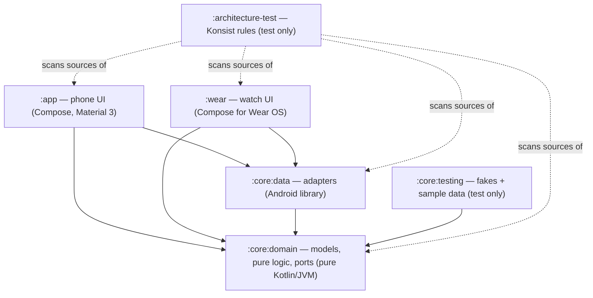

# Architecture

QIt is a Quran player for phone and Wear OS, built as clean architecture with ports and adapters.
The domain is a pure Kotlin island; everything Android (ExoPlayer, DataStore, assets, the Wearable
data layer) lives in adapters behind interfaces. Both apps (`:app`, `:wear`) are thin presentation
layers over the same core.

## Modules

Dependency rule: **inward only**. `:core:domain` imports nothing from Android or the outer layers
(enforced by `DomainIsolationTest`); presentation code (`..presentation..`) imports domain ports
only, never `dev.sadakat.qit.core.data` (enforced by `PresentationIsolationTest`). Both tests are
Konsist rules in `:architecture-test`.

## The domain (`:core:domain`)

**Fixed structure of the Quran** — `model/QuranMeta.kt` knows the 114 surah lengths and converts
between per-surah ayah numbers and the global ayah numbering (1..6236) every audio source uses. It
also answers `hasBasmalaPrefix` (true for every surah except Al-Fatiha and At-Tawbah).

**Models** (`model/`):

- `Surah` — number, Arabic/transliterated/English names, ayah count, `Revelation` (Meccan/Medinan).
- `Ayah` — one verse with Arabic (Uthmani), English (Saheeh International) and Bangla (Muhiuddin
  Khan) text; `translation(track)` picks the translation of a track.
- `AyahRef` — a position (`surah`, `ayah`); ayah 0 is the basmala before verse 1.
- `Track` — one recording: `ARABIC`/`ENGLISH`/`BANGLA` with stable codes `ar`/`en`/`bn` used in
  media ids, download ids and messages.
- `RecitationMode` — what plays for each ayah, in order: `ARABIC_ONLY`, `ARABIC_ENGLISH` or
  `ARABIC_BANGLA`.

**Pure logic** (`audio/`):

- `QuranAudioUrls` — where each verse file lives (see [Audio sources](#audio-and-downloads)) and
  the download id of each file (`"ar/255"`, `"bn/intro/2"`, …).
- `QueuePlan` — builds a surah's play queue and computes next/previous by ayah (see
  [The queue model](#the-queue-model)).
- `DownloadAggregation` — derives per-surah download state from per-file state (see
  [Downloads](#audio-and-downloads)).

**Ports** — interfaces the adapters implement:

| Port | Package | What it gives |
| --- | --- | --- |
| `QuranText` | `repository/` | All surahs and every surah's ayahs (offline, from assets) |
| `QuranSettings` | `repository/` | `Flow<RecitationMode>` and `Flow<LastPosition?>`, persisted |
| `SurahDownloads` | `repository/` | `StateFlow<Map<Int, Map<Track, SurahDownloadState>>>` (surah number → track → state), `download(surah, tracks)`, `remove(surah, tracks)` |
| `QuranPlayer` | `player/` | `StateFlow<NowPlaying?>` + `StateFlow<String?>` error; `play`, `togglePlayPause`, `nextAyah`, `previousAyah`, `stop`, `restoreLast` |

## The adapters (`:core:data`)

| Port | Adapter | How |
| --- | --- | --- |
| `QuranText` | `text/AssetQuranText` | Reads `assets/quran/surahs.json` and `assets/quran/text/001..114.json` (generated by `scripts/build_quran_text.py`), parsed by `QuranTextParser`; keeps the 6 most recently used surahs in memory |
| `QuranSettings` | `settings/DataStoreQuranSettings` | Preferences DataStore `quran_settings` |
| `SurahDownloads` | `audio/MediaSurahDownloads` | Media3 `DownloadManager` from `QuranCache`, one download per verse file |
| `QuranPlayer` | `player/ExoQuranPlayer` | The app-wide `ExoPlayer` |

Supporting pieces: `audio/QuranCache` (the shared cache + download manager), `audio/QuranDownloadService`
(foreground service for downloads), `audio/QuranMediaItems` (queue → media items), `link/QuranDownloadMessage`
+ `link/WearPaths` (phone → watch message).

## The queue model

`QueuePlan.plan(surah, mode)` builds the queue as a flat list of `QueueEntry`s:

1. **Basmala prefix** (ayah 0), only for surahs with one (`QuranMeta.hasBasmalaPrefix`):
   - Arabic only → the Arabic basmala,
   - Arabic + English → Arabic basmala, then the English one,
   - Arabic + Bangla → only the Bangla intro (`bn/intro/{surah}`) — it already contains the Arabic
     basmala followed by its translation, so no separate Arabic prefix.
2. **Verses** — for each ayah 1..ayahCount, one entry per track of the mode, in the mode's order.

Each entry's identity is a `QueueItemId` (`surah`, `ayah`, `track`); its media id is
`"{surah}:{ayah}:{trackCode}"`, e.g. `2:255:ar`. `QueueItemId.parse` is the inverse, returning null
for anything that is not a Quran queue item.

Navigation is **by ayah, not by item**: because ayah numbers grow monotonically along the queue,
`nextAyahIndex` finds the first item beyond the current ayah's, and `previousAyahIndex` restarts the
current ayah when the player is past its first item or more than 3 s into it, else jumps to the
previous ayah's first item. The same rules apply to the media notification's next/previous buttons
(see below).

## Audio and downloads

Three verse-by-verse recordings, addressed by global ayah number (`QuranAudioUrls`):

| Track | Source |
| --- | --- |
| Arabic (Alafasy, 128k) | `https://cdn.islamic.network/quran/audio/128/ar.alafasy/{global}.mp3` |
| English (Walk, 192k) | `https://cdn.islamic.network/quran/audio/192/en.walk/{global}.mp3` |
| Bangla | `https://huggingface.co/datasets/faddy001/quran_audio/resolve/main/bangla/bangla-translation-verses/{NNNNN}.mp3` |

Arabic and English reuse verse 1 of the Quran (which *is* the basmala) as their basmala; Bangla uses
a per-surah intro file. `QuranAudioUrls.surahFiles(surah, track)` lists every file a surah/track
pair needs — basmala (if any) plus all verses.

**One Media3 download per verse file.** `MediaSurahDownloads.download(surah, tracks)` enqueues a
`DownloadRequest` per file into `QuranCache`'s `DownloadManager` (max 4 parallel downloads, requires
a network), skipping files already completed, and starts `QuranDownloadService` so downloads survive
the app going away. Downloaded files land in `QuranCache`'s `SimpleCache`
(`<filesDir>/quran_audio`, never evicted — files leave only through `remove`).

**Aggregation** (`DownloadAggregation`): the state of a surah/track pair is derived from the states
of its files, keyed by download id. Download ids are globally unique per verse file — except the
shared basmala `"ar/1"`/`"en/1"`, which every surah's file list contains (and which doubles as
Al-Fatiha's first verse). The aggregator therefore only counts *own* files — ids that belong to this
pair alone — when deciding whether a pair is tracked at all, so downloading Al-Baqarah never makes
Al-Fatiha look half-downloaded. A pair is `Downloaded` when all files are completed, `Downloading`
while any file is active, `Failed` when some failed for good (downloading again retries).
`remove` deletes a pair's files, but keeps a shared basmala alive while any other tracked pair still
needs it. The combined `stateOf(surah, tracks)` helpers roll several tracks (e.g. a mode's) into
one state for the UI.

## Playback wiring

Both apps use **one app-wide `ExoPlayer`** (provided by each app's `di/MediaModule.kt`), with a
`CacheDataSource` from `QuranCache`: downloaded files are read from the cache (works offline), and
anything else streams over the network — the data source is **read-only for streaming**
(`setCacheWriteDataSinkFactory(null)`), so streaming never masquerades as a download.

`ExoQuranPlayer` implements `QuranPlayer` on that player:

- `play(surah, fromAyah, mode)` builds the media items (`QuranMediaItems`: uri = the file's URL,
  which is also the cache key; media id = the queue item id; metadata for the notification, e.g.
  title "Al-Baqara 2:255"), seeks to the first item of `fromAyah`, prepares, plays, and starts the
  app's `MediaSessionService` (resolved through its `androidx.media3.session.MediaSessionService`
  intent filter) so playback survives the background.
- Player listener events are folded into `nowPlaying: StateFlow<NowPlaying?>` (surah, ayah, track,
  mode, isPlaying, isBuffering) and `error: StateFlow<String?>` (network failures get a
  "check your connection or download this surah" message; the error clears when playback resumes).
- The position is persisted via `QuranSettings.saveLastPosition` whenever the **ayah** changes
  (moving between tracks of the same ayah does not rewrite it).
- `restoreLast` re-queues the saved position, paused, so the player bar reappears after an app
  restart.

**MediaSession.** The session wraps not the raw player but `ExoQuranPlayer.sessionPlayer` — an
ayah-aware `ForwardingPlayer` whose `seekToNext`/`seekToPrevious` (and their media-item variants)
delegate to `nextAyah()`/`previousAyah()`. So the notification's skip buttons move by ayah, not by
track. The phone's `service/QuranPlaybackService` (`MediaSessionService`) injects the singleton
`MediaSession` built in `di/MediaModule.kt`; the watch's `service/QuranPlaybackService` builds the
same kind of session over its own player instance.

## Phone → watch

The reader's "send to watch" action calls `WatchConnection` (an interface in `:app` so the ViewModel
stays testable). `WatchLink` implements it over the Wearable Data Layer: it looks up reachable
nodes by the `qit_watch_app` capability (declared in each app's `res/values/wear.xml`) and sends a
`QuranDownloadMessage` (`{surah, trackCodes}`, kotlinx.serialization JSON) on the
`/quran/download` path.

On the watch, `service/QuranMessageService` (a `WearableListenerService`) receives it; payload
handling lives in the top-level `handleQuranMessage` function (unit-tested): bad payloads or invalid
surahs/tracks are logged and dropped, anything valid goes to `SurahDownloads.download`.

Because a watch on Bluetooth would crawl through the phone's proxy network, the watch's
`network/WifiForDownloads` watches the download states and, while any surah is downloading, requests
a Wi-Fi network and binds the process to it (`WifiRequestStateMachine` turns download activity into
rising/falling edges so the request isn't churned); it releases the network when downloads finish.

## Testing strategy

- **Fakes, not mocks** — `:core:testing` ships `FakeQuranText`, `FakeSurahDownloads`,
  `FakeQuranSettings`, `FakeQuranPlayer`, sample data (`TestQuran`: real surah structure,
  placeholder text) and `MainDispatcherRule`. Tests use these; no new fakes of the ports.
- **Pure logic on the JVM** — `QueuePlan`, `DownloadAggregation`, `QuranAudioUrls`, `SurahSearch`
  and `QuranTextParser` are plain functions/objects tested without Android.
- **Robolectric** for everything touching Android (sdk 34, pinned per module in
  `src/test/resources/robolectric.properties`), including Compose UI tests
  (`createComposeRule()`) for the screens.
- **Media3 test utils** (`media3-test-utils-robolectric`: `TestExoPlayerBuilder`,
  `TestPlayerRunHelper`) drive `ExoQuranPlayer` against a real, clock-controlled player in
  `:core:data`'s tests.
- **Coroutines** — `kotlinx-coroutines-test` (`runTest`) and Turbine (`flow.test { }`).
- **Architecture tests** — `:architecture-test` holds the Konsist rules: domain purity
  (`DomainIsolationTest`), presentation isolation (`PresentationIsolationTest`), ViewModel shape
  (one immutable `StateFlow<UiState>`, no `Context`, no public `MutableStateFlow` —
  `ViewModelArchitectureTest`, `UiStateArchitectureTest`) and `*Test` naming
  (`TestNamingArchitectureTest`). They read all modules' sources, so after changing another
  module's sources force a re-run: `./gradlew :architecture-test:test --rerun-tasks`.
- **Coverage** — Kover: at least 70 % aggregate line coverage (`./gradlew :koverVerify`) and 90 %
  in `:core:domain`.

`./gradlew qualityGate` runs all of this plus spotless, detekt and lint — see [QUALITY.md](QUALITY.md).
